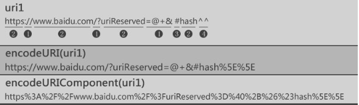

## 数据类型--String

1. 定义： 字符串就是零个或多个排在一起的字符，放在单引号或双引号之中。

> 'abc' / "abc" / 'abc "bcd" ' / "adad \\(反斜杠,转义)"

1. 多行字符串
```
var string = 'good \n good \n study \n day \n day \n up'
```

3. 转义
```
  \0 : null（\u0000  
  \b : 后退键（\u0008）  
  \f ：换页符（\u000C）  
  \n ：换行符（\u000A）  
  \r ：回车键（\u000D）  
  \t ：制表符（\u0009）  
  \v ：垂直制表符（\u000B）  
  \' ：单引号（\u0027）  
  \" ：双引号（\u0022）  
  \\ ：反斜杠（\u005C）
```

3. 1 反斜杠输出Unicode码点  
```
'\251' // "©"
'\xA9' // "©"
'\u00A9' // "©"
```

4. 字符串和数组(了解就好)  
```
var s = 'hello';
s[0] // "h"
s[1] // "e"
s[4] // "o"
```  

5. length属性
```
var string = '12313'
string.length //5
```  
6.  Base64 转码
有时，文本里面包含一些不可打印的符号，比如 ASCII 码0到31的符号都无法打印出来，这时可以使用 Base64 编码，将它们转成可以打印的字符。
```
btoa()：任意值转为 Base64 编码
atob()：Base64 编码转为原来的值
```
PS: 注意，这两个方法不适合非 ASCII 码的字符，会报错。要将非 ASCII 码字符转为 Base64 编码，必须中间插入一个转码环节，再使用这两个方法。
```
function b64Encode(str) {
  return btoa(encodeURIComponent(str));
}

function b64Decode(str) {
  return decodeURIComponent(atob(str));
}

b64Encode('你好') // "JUU0JUJEJUEwJUU1JUE1JUJE"
b64Decode('JUU0JUJEJUEwJUU1JUE1JUJE') // "你好"
```

7. 扩展知识 encodeURI、encodeURIComponent、decodeURI、decodeURIComponent
统一资源标识符，或叫做 URI，是用来标识互联网上的资源（例如，网页或文件）和怎样访问这些资源的传输协议（例如，HTTP 或 FTP）的字符串。

- encodeURI 和 decodeURI 函数操作的是完整的 URI；这俩函数假定 URI 中的任何保留字符都有特殊意义，所有不会编码它们。

- encodeURIComponent 和 decodeURIComponent 函数操作的是组成 URI 的个别组件；这俩函数假定任何保留字符都代表普通文本，所以必须编码它们，所以它们（保留字符）出现在一个完整 URI 的组件里面时不会被解释成保留字符了。


